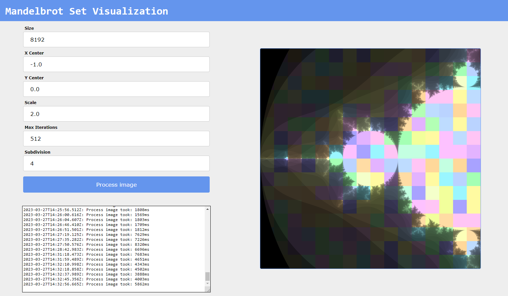
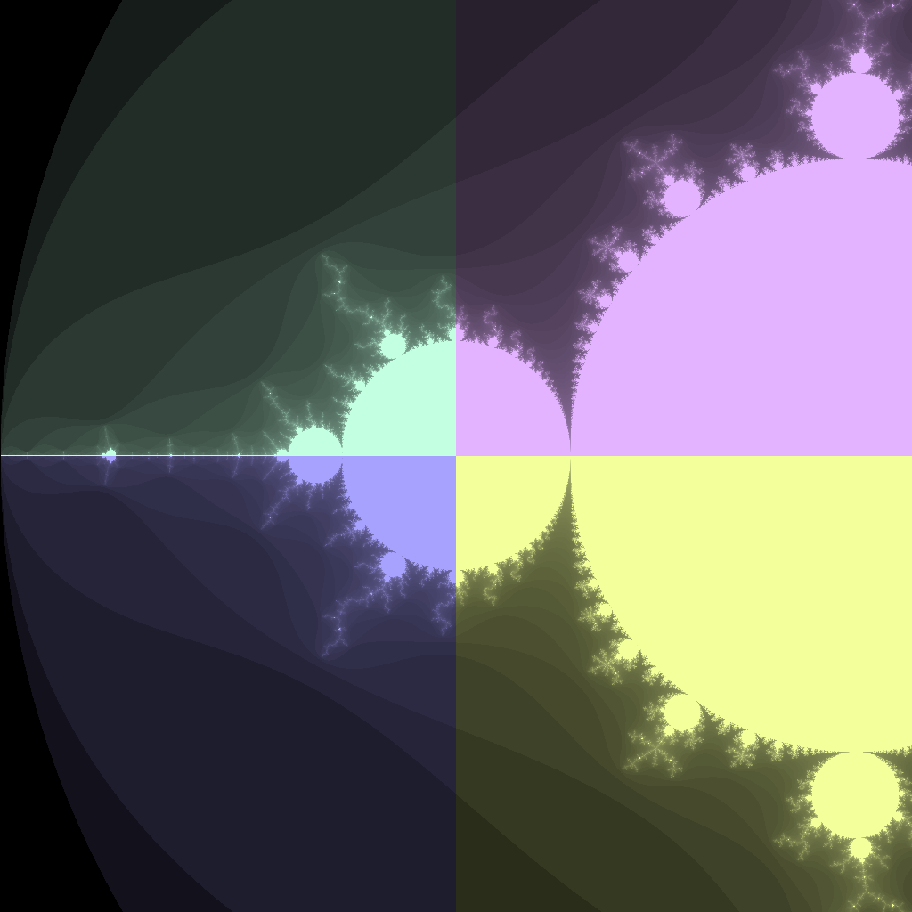

# Mandelbrot Set Visualization

An application that allows asynchronously generating a visualization of a mandelbrot set by
partitioning the set into chunks.

The application is implemented as two microservices:

* **ui-service** - the web application with a nice-looking interface
* **process-service** - the backend for generating one of the chunks

> The application supports both local startup and startup in a Kubernetes cluster.



## Prerequisites

* [Java 17](https://www.oracle.com/java/technologies/downloads/#java17) or later
* ~~Gradle~~ or [Apache Maven 3.8+](https://maven.apache.org/download.cgi)
* [kubectl v1.25.4+](https://kubernetes.io/ru/docs/tasks/tools/install-kubectl/)
* [Kubernetes v1.25.4+](https://kubernetes.io/docs/home/)

## How to build

Just run one of the scripts suitable for your operating system.

For Linux:

```bash
./mvnw clean install
```

For Windows:

```bash
mvnw.cmd clean install
```

If you don't have the ability or desire to build a project, you can use my latest build 
and jump to [Creating Namespace](#creating-namespace):

* [ui-service](https://hub.docker.com/r/petrolingus/ui-service)
* [process-service](https://hub.docker.com/r/petrolingus/process-service)

## How to run

Launch `ui-service` on port **8082**:
```bash
java -jar ui-service/target/ui-service-0.0.1-SNAPSHOT.jar --server.port=8081
```

Launch `process-service` on port **8081**:
```bash
java -jar ui-service/target/ui-service-0.0.1-SNAPSHOT.jar --server.port=8081
```

## How to deploy

### Building Docker images

First, you need to create a docker image for each of the services:

```bash
docker build --tag <repository:tag> ./process-service
docker build --tag <repository:tag> ./ui-service
```

Example:

```bash
docker build --tag petrolingus/process-service:latest ./process-service
docker build --tag petrolingus/ui-service:latest ./ui-service
```

And then push it to some repository (e.g. Docker Hub):

```bash
docker push <repository:tag>
```

Example:

```bash
docker push petrolingus/process-service:latest
docker push petrolingus/ui-service:latest
```

### Creating Namespace

Create namespace in your kubernetes cluster:

```bash
kubectl create namespace mandelbrot
```

### Creating Deployments and Services

> **Note**
> Before applying the templates, you must configure them in the
> `/process-service/kubernetes` and `/ui-service/kubernetes` directories.

Create kubernetes service for communicate frontend and backend:

```bash
kubectl apply -f process-service/kubernetes/service.yaml -n mandelbrot
```

Now you can create deployments:

```bash
kubectl apply -f process-service/kubernetes/deployment.yaml -n mandelbrot
kubectl apply -f ui-service/kubernetes/deployment.yaml -n mandelbrot
```

For access to web interface of ui-service you need to ~~create ingress or~~ expose LoadBalancer service:

```bash
kubectl expose deployment ui-service --type=LoadBalancer --name=ui-service-ext -n mandelbrot
```

## Web Interface Description

On the web page there is a settings panel, which includes the following parameters:

* **Size** - image size in pixels
* **X Center** - the ***real part*** of the image center of coordinates in the complex space
* **Y Center** - the ***imaginary part*** of the image center of coordinates in the complex space
* **Scale** - image scale in a complex space
* **Max Iterations** - the number of checks for the occurrence of a point in the Mandelbrot set
* **Subdivision** - the number of image splits into chunks (exponential growth)

### Subdivision explain

The image is divided into chunks, each of which is generated separately in the processing service.
The color of the chunk depends on the service where the image was processed and is constant until the processing service is restarted

> **Note** 
> Since the color used by the **process-service** is randomly generated, it is possible that several services will have
> similar colors.

|                  Subdivision = 0                  |                  Subdivision = 1                  | Subdivision = 2                                   |
|:-------------------------------------------------:|:-------------------------------------------------:|---------------------------------------------------|
|  |  |  |

### Processing log

Processing information, such as time spent, is displayed in the built-in console under the **Process image** button.

## Extra Links

1. [Running Kubernetes and the dashboard with Docker Desktop](https://andrewlock.net/running-kubernetes-and-the-dashboard-with-docker-desktop/)