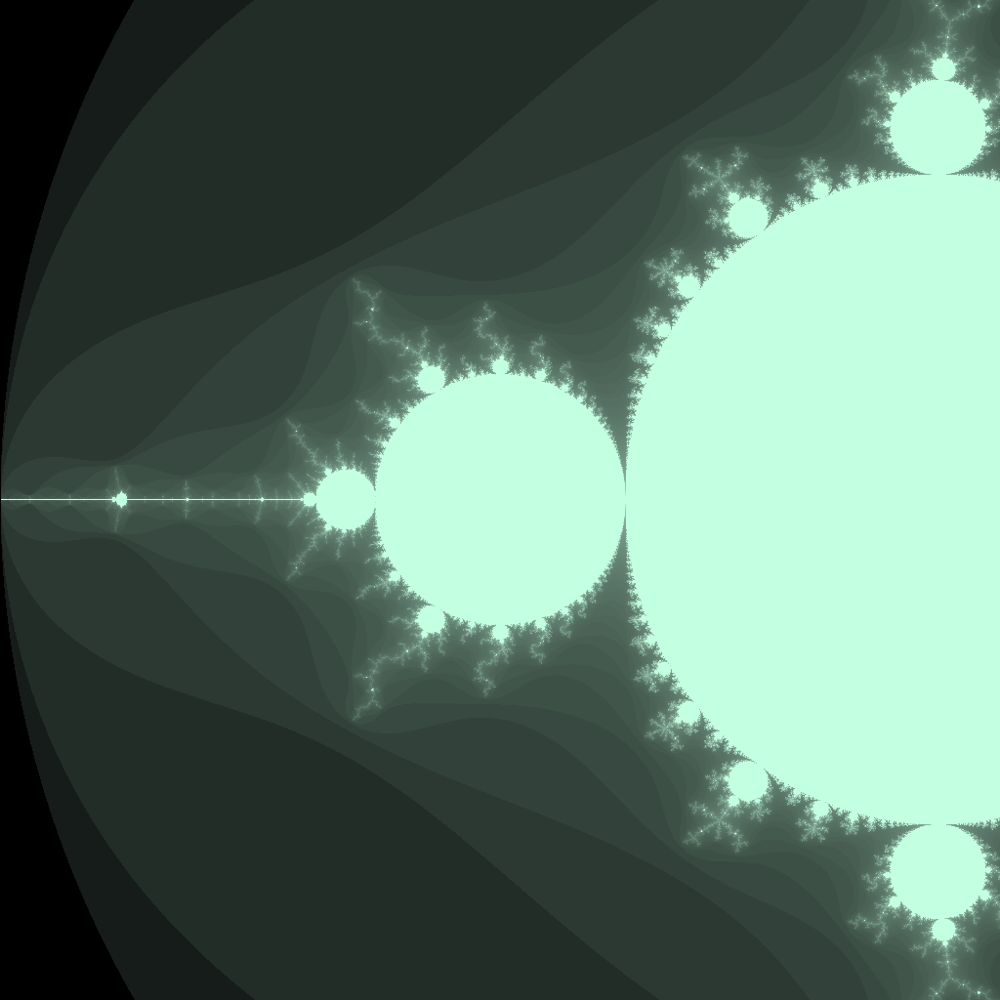
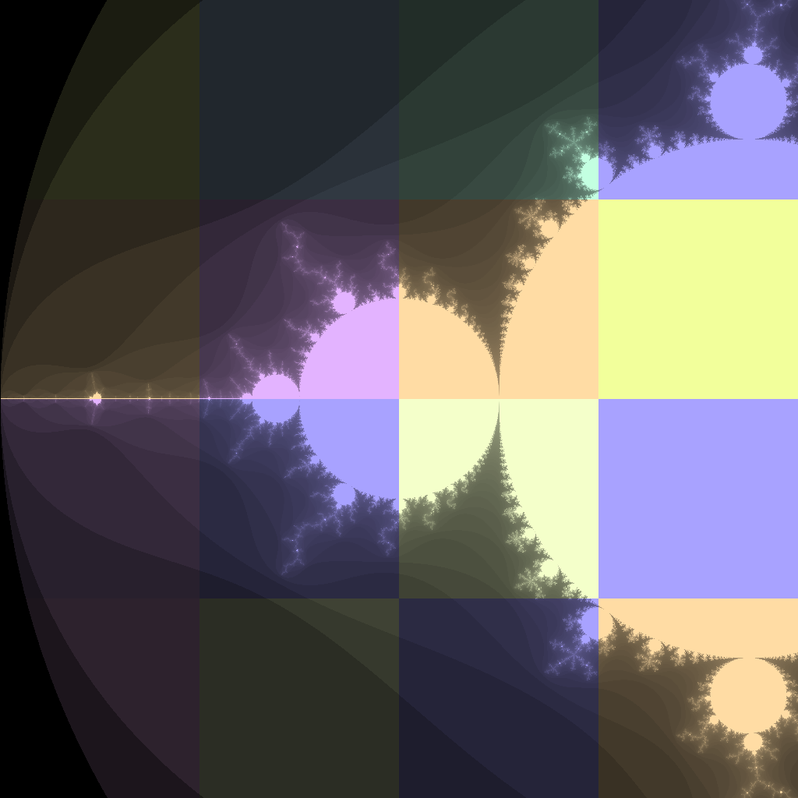
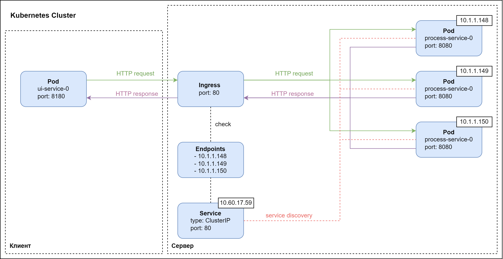
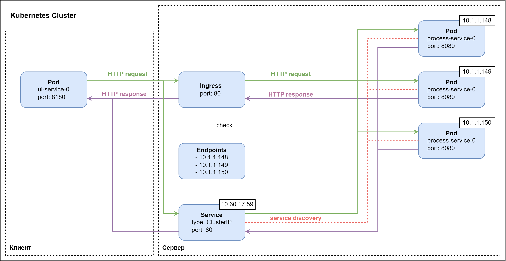

# Описание работы

## Основные компоненты

Основаня задача работы заключается в исследовании времени генерации множества Мандельброта с целью его уменьшения. 
Рассмотрим глобально как происходит процесс генерации изображения:

1. Исходное изображениие, которое нужно сгенерировать, разбивается на части.
2. Каждая часть изображения генерируется независимо друг от друга на обработчиках.
3. После чего все части собираются в одно изображение.

Таким образом можно выделить следующие компоненты:

1. Клиент (ui-service/фронденд) - принимает параметры от пользователя, а затем отправляет запросы на генерацию частей 
изображения, после чего собирает части в одно изображение
2. Обработчик (process-service/бекэнд) - принимает запросы от клиента и генерирует часть изображения. Обработчиков 
может быть любое колчичество

Рассмотрим каждый компонент более детально.

### Клиент

Представляет из себя веб-приложение на языке программирования Java. Имеет один эндпоинт в котором передаются параметры
для генерации множеста Мандельброта:

```txt
/api/v1/get-mandelbrot-image?size=512&xc=-1&yc=0&scale=2&iterations=128&subdivision=4&executors=1
```

Описание параметров:

* size - размер изображения в пикселях
* xc - абцисса центра изображения 
* yc - ордината центра изображения 
* scale - масштаб
* iterations - количество проверок на вхождение в множество Мандельброта
* subdivision - параметр отвечающий за разбиение изображения на части
* executors - количество потоков, которые будут отправлять запросы на обработчики

Пример различных значений параметра subdivision:

|                  Subdivision = 0                  |                  Subdivision = 1                  | Subdivision = 2                                   |
|:-------------------------------------------------:|:-------------------------------------------------:|---------------------------------------------------|
|  |  |  |


Каждый из обрабочиков окращивает свой кусочек в определенный цвет, это нужно для того, чтобы показать, что изображение
генерируется на разных обработчиках. Однако стоит имень ввиду, что так как цвет генерируется случайно при запуске
обработчика, то может случится такая ситуация при которой некоторые цвета будут очень похожи друг на друга, из-за чего
будет сложно отличить их визуально.

### Обработчик

Представляет из себя приложения на Java, которое генерирует часть изображения. Обработчик так же как и клиент имеет
один эндпоинт:

```txt
/api/v1/generate-mandelbrot-tile?size=128&xc=-1&yc=0&scale=2&iterations=128
```

Параметры, который принимает обработчик от клиента такие-же, однако они расчитываются на клиенте. И для каждой
части изображения они будут свои.

Так же обработчик имеет переменную окружения `BREAKDOWN_PROBABILITY`, которая отвечает за вероятность выхода из строя
обработчика при выполнении запроса.

### Коммуникация между компонентами

Клиент и обработчик в процессе отправки и получения запросов должны как-то коммуницировать между собой. Так как в работе
используется Kubernetes, то для коммуникации используется стандартный объект K8S Service. Как и любой компонент,
Service в Kubernetes описывается с помощью yaml-манифеста.

```yaml
apiVersion: v1
kind: Service
metadata:
  name: process-service
spec:
  type: ClusterIP
  selector:
    app.kubernetes.io/name: process-service
  ports:
    - protocol: TCP
      port: 80
      targetPort: 8080
```

Приведенное выше описание позволяет создать объект Service, который будет отслеживать все реплики обработчиков (через
service discovery). Так же объект Service создает уникальный эндпоинт, по которому можно обратиться для доступа к 
обработчикам. Задача переадресации трафика ложится на Service. Такая схема общения представлена на изображении ниже:


У такого подхода есть несколько недостатков:

1. Переадресация осуществоляется случайно
2. Если обработчик во время выполнения запроса выйдет из строя, то клиент будет вынужден повторить запрос

Для решения этих проблем и для уменьшения времени генерации изображения предлагается использовать другой подход. Так 
например среди объектов Kubernetes существует так называемый Ingress, который расширяет возможности обычного сервиса
за счет того, что имеет более детальные настройки переадресации трафика.

Одной из таких настроек является автоматическое переотправка запроса в случае его неудачного выполнения. То есть если
Service возращает ошибку на клиент, в случае если послдений аварийно завершается, то Ingress передает запрос к другому
обработчику. Такой подход позволяет сэкономить время и накладные ресурсы при переотправки запросов от клиента.

Описание Ingress точно так же как и описание Service осуществялется с помощью yaml-манифеста:

```yaml
apiVersion: networking.k8s.io/v1
kind: Ingress
metadata:
  name: ingress-process-service
  annotations:
    kubernetes.io/ingress.class: nginx
    nginx.ingress.kubernetes.io/proxy-connect-timeout: "15"
    nginx.ingress.kubernetes.io/proxy-next-upstream: "error timeout http_502 http_503 http_504"
    nginx.ingress.kubernetes.io/proxy-next-upstream-tries: "0"
    nginx.ingress.kubernetes.io/proxy-next-upstream-timeout: "0"
spec:
  rules:
    - host: localhost
      http:
        paths:
          - backend:
              service:
                name: process-service
                port:
                  number: 80
            path: /
            pathType: ImplementationSpecific
  ingressClassName: nginx
```

Для того, чтобы Ingress работал, ему необходим Service, однако запросы будут идти через Ingress напрямую. Service же в 
данном случае используется только как service-discovery, то есть механизм, который будет следить за обработчиками и
поддерживать список эндпоинтов актуальным. Все это можно описать с помощью следующей схемы:



## Исследование

### Описание исследования

Основная задача работы заключается в исследовании времени генерации с помощью объекта Ingress, а так же сравнение его
с объектом Service.

Для того, чтобы провести практическую часть работы, предлагается реализовать следующую схему, которая будет использовать
оба варианта коммуникации (через Ingress и Service):



Исследование будет состоять из двух частей:

1. Исследование общей времени генерации изображения при различных параметрах, таких как напирмер количество подов
2. Исследование времени генерации с учетом различных ошибок (выход обработчика из строя, таймаут)

### Исследование общей времени генерации изображения

Для данной части исследования рассмотрим общее время генерации при различном числе обработчиков от 1 до 16.
Ресурсы обработчика ограничены следующими значениями:

```yaml
requests:
  cpu: "250m"
  memory: "256Mi"
limits:
  cpu: "250m"
  memory: "256Mi"
```


