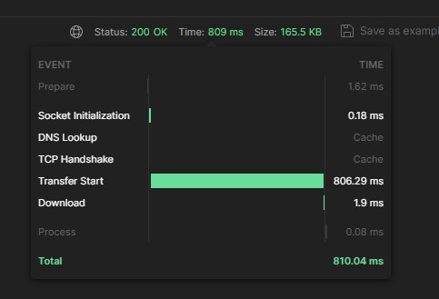

## Ответы на вопросы

1. Проверка расчета времени при ошибке 0%

    ```txt
    10.1.5.3 - - [15/Dec/2023:01:47:13 +0000] "GET /api/v1/generate-mandelbrot-tile?size=512&xc=-1.5&yc=0.5&scale=1.0&iterations=256 HTTP/1.1" 200 2603224 "-" "Java/19" 235 0.069 [mandelbrot-process-service-80] [] 10.1.5.60:8080 2600999 0.069 200 50145b36dff8b913fdd17d556bbd083c
    10.1.5.3 - - [15/Dec/2023:01:47:13 +0000] "GET /api/v1/generate-mandelbrot-tile?size=512&xc=-0.5&yc=0.5&scale=1.0&iterations=256 HTTP/1.1" 200 2327997 "-" "Java/19" 235 0.311 [mandelbrot-process-service-80] [] 10.1.5.61:8080 2326010 0.311 200 a124a16941e68031c5e9b986c5b0a54b
    10.1.5.3 - - [15/Dec/2023:01:47:13 +0000] "GET /api/v1/generate-mandelbrot-tile?size=512&xc=-1.5&yc=-0.5&scale=1.0&iterations=256 HTTP/1.1" 200 2560628 "-" "Java/19" 236 0.031 [mandelbrot-process-service-80] [] 10.1.5.53:8080 2558443 0.031 200 83b0c3629c67d5e95600e13d58fe40f1
    10.1.5.3 - - [15/Dec/2023:01:47:14 +0000] "GET /api/v1/generate-mandelbrot-tile?size=512&xc=-0.5&yc=-0.5&scale=1.0&iterations=256 HTTP/1.1" 200 2199049 "-" "Java/19" 236 0.327 [mandelbrot-process-service-80] [] 10.1.5.54:8080 2197160 0.327 200 9e11e5dfd75ee415597097a997de5a19
    ```

   0.069 + 0.311 + 0.031 + 0.327 = 0.738

   

2. Проверка расчета времени при ошибке 4%

    ```txt
    10.1.5.3 - - [15/Dec/2023:02:27:16 +0000] "GET /api/v1/generate-mandelbrot-tile?size=128&xc=-1.75&yc=-0.75&scale=0.5&iterations=128 HTTP/1.1" 200 164153 "-" "Java/19" 238 0.005 [mandelbrot-process-service-80] [] 10.1.5.133:8080 164011 0.005 200 8e700ca3d8e29f6cd66bc990cd3bde20
    10.1.5.3 - - [15/Dec/2023:02:27:16 +0000] "GET /api/v1/generate-mandelbrot-tile?size=128&xc=-1.25&yc=-0.75&scale=0.5&iterations=128 HTTP/1.1" 200 164153 "-" "Java/19" 238 0.007 [mandelbrot-process-service-80] [] 10.1.5.135:8080 164011 0.007 200 89a5a79615f059e53d7fd6ddbd04eb52
    10.1.5.3 - - [15/Dec/2023:02:27:16 +0000] "GET /api/v1/generate-mandelbrot-tile?size=128&xc=-1.75&yc=0.25&scale=0.5&iterations=128 HTTP/1.1" 200 162626 "-" "Java/19" 237 0.006 [mandelbrot-process-service-80] [] 10.1.5.137:8080 162487 0.006 200 f4441782acce3a4430130504d032f357
    10.1.5.3 - - [15/Dec/2023:02:27:16 +0000] "GET /api/v1/generate-mandelbrot-tile?size=128&xc=-1.75&yc=0.75&scale=0.5&iterations=128 HTTP/1.1" 200 164153 "-" "Java/19" 237 0.012 [mandelbrot-process-service-80] [] 10.1.5.147:8080 164011 0.011 200 51a49444628e4da529a1ce9ead0f2cd9
    10.1.5.3 - - [15/Dec/2023:02:27:16 +0000] "GET /api/v1/generate-mandelbrot-tile?size=128&xc=-1.25&yc=0.25&scale=0.5&iterations=128 HTTP/1.1" 200 159171 "-" "Java/19" 237 0.018 [mandelbrot-process-service-80] [] 10.1.5.140:8080 159038 0.018 200 43354466596d1b787de48242756e8782
    10.1.5.3 - - [15/Dec/2023:02:27:16 +0000] "GET /api/v1/generate-mandelbrot-tile?size=128&xc=-1.75&yc=-0.25&scale=0.5&iterations=128 HTTP/1.1" 200 163721 "-" "Java/19" 238 0.019 [mandelbrot-process-service-80] [] 10.1.5.146:8080 163582 0.019 200 bb6236f57935e3f0bb0c034a8a492a10
    10.1.5.3 - - [15/Dec/2023:02:27:16 +0000] "GET /api/v1/generate-mandelbrot-tile?size=128&xc=-0.25&yc=-0.25&scale=0.5&iterations=128 HTTP/1.1" 200 147739 "-" "Java/19" 238 0.024 [mandelbrot-process-service-80] [] 10.1.5.140:8080 147611 0.023 200 bf770d0464eb34bca8266fcc1107a683
    10.1.5.3 - - [15/Dec/2023:02:27:16 +0000] "GET /api/v1/generate-mandelbrot-tile?size=128&xc=-0.75&yc=-0.75&scale=0.5&iterations=128 HTTP/1.1" 200 161610 "-" "Java/19" 238 0.004 [mandelbrot-process-service-80] [] 10.1.5.135:8080 161471 0.004 200 024be7594b851aa9f9aead60fd3d20b2
    10.1.5.3 - - [15/Dec/2023:02:27:16 +0000] "GET /api/v1/generate-mandelbrot-tile?size=128&xc=-0.25&yc=0.25&scale=0.5&iterations=128 HTTP/1.1" 200 98496 "-" "Java/19" 237 0.024 [mandelbrot-process-service-80] [] 10.1.5.138:8080 98411 0.024 200 b0e20e07b3316cbab7a552a0a3c2aa94
    10.1.5.3 - - [15/Dec/2023:02:27:16 +0000] "GET /api/v1/generate-mandelbrot-tile?size=128&xc=-0.75&yc=0.25&scale=0.5&iterations=128 HTTP/1.1" 200 151027 "-" "Java/19" 237 0.029 [mandelbrot-process-service-80] [] 10.1.5.146:8080 150901 0.030 200 a555d68ed365626aa7ff99e2469fc72f
    10.1.5.3 - - [15/Dec/2023:02:27:16 +0000] "GET /api/v1/generate-mandelbrot-tile?size=128&xc=-0.75&yc=-0.25&scale=0.5&iterations=128 HTTP/1.1" 200 152474 "-" "Java/19" 238 0.028 [mandelbrot-process-service-80] [] 10.1.5.141:8080 152342 0.028 200 e5766d091c1b25ec0cd2ee7fe8fc0756
    10.1.5.3 - - [15/Dec/2023:02:27:16 +0000] "GET /api/v1/generate-mandelbrot-tile?size=128&xc=-0.25&yc=0.75&scale=0.5&iterations=128 HTTP/1.1" 200 154556 "-" "Java/19" 237 0.029 [mandelbrot-process-service-80] [] 10.1.5.142:8080 154424 0.029 200 62681302e1a64a422dd7f515f69bbd18
    10.1.5.3 - - [15/Dec/2023:02:27:16 +0000] "GET /api/v1/generate-mandelbrot-tile?size=128&xc=-0.75&yc=0.75&scale=0.5&iterations=128 HTTP/1.1" 200 162758 "-" "Java/19" 237 0.006 [mandelbrot-process-service-80] [] 10.1.5.143:8080 162619 0.006 200 4f94403768405838f291cf0eea1468d5
    10.1.5.3 - - [15/Dec/2023:02:27:16 +0000] "GET /api/v1/generate-mandelbrot-tile?size=128&xc=-1.25&yc=-0.25&scale=0.5&iterations=128 HTTP/1.1" 200 159299 "-" "Java/19" 238 0.072 [mandelbrot-process-service-80] [] 10.1.5.140:8080 159166 0.072 200 898f4e8672c1d274b73373cb8165ec89
    2023/12/15 02:27:17 [error] 840#840: *61760972 upstream timed out (110: Operation timed out) while reading response header from upstream, client: 10.1.5.3, server: ingress-nginx-controller.ingress-nginx, request: "GET /api/v1/generate-mandelbrot-tile?size=128&xc=-1.25&yc=0.75&scale=0.5&iterations=128 HTTP/1.1", upstream: "http://10.1.5.134:8080/api/v1/generate-mandelbrot-tile?size=128&xc=-1.25&yc=0.75&scale=0.5&iterations=128", host: "ingress-nginx-controller.ingress-nginx"
    10.1.5.3 - - [15/Dec/2023:02:27:17 +0000] "GET /api/v1/generate-mandelbrot-tile?size=128&xc=-1.25&yc=0.75&scale=0.5&iterations=128 HTTP/1.1" 200 164153 "-" "Java/19" 237 1.004 [mandelbrot-process-service-80] [] 10.1.5.134:8080, 10.1.5.143:8080 0, 164011 1.000, 0.003 504, 200 444db4c5bfba02eefb366e451e67bb0c
    2023/12/15 02:27:17 [error] 841#841: *61760977 upstream timed out (110: Operation timed out) while reading response header from upstream, client: 10.1.5.3, server: ingress-nginx-controller.ingress-nginx, request: "GET /api/v1/generate-mandelbrot-tile?size=128&xc=-0.25&yc=-0.75&scale=0.5&iterations=128 HTTP/1.1", upstream: "http://10.1.5.132:8080/api/v1/generate-mandelbrot-tile?size=128&xc=-0.25&yc=-0.75&scale=0.5&iterations=128", host: "ingress-nginx-controller.ingress-nginx"
    10.1.5.3 - - [15/Dec/2023:02:27:17 +0000] "GET /api/v1/generate-mandelbrot-tile?size=128&xc=-0.25&yc=-0.75&scale=0.5&iterations=128 HTTP/1.1" 200 155198 "-" "Java/19" 238 1.006 [mandelbrot-process-service-80] [] 10.1.5.132:8080, 10.1.5.141:8080 0, 155066 1.000, 0.006 504, 200 4664f4771b26ab6f483f3d7c0d033b77
    
    2023-12-15T02:27:17.262Z  INFO 1 --- [nio-8080-exec-8] m.p.m.uiservice.TestController           : Experiment #9 took: 1052ms
    ```

3. Роутинг через Service

```txt
2023-12-15T05:38:05.043Z  INFO 1 --- [nio-8080-exec-1] m.p.m.processservice.ImageService        : Running /api/v1/generate-mandelbrot-tile?size=128&xc=-1.75&yc=-0.75&scale=0.5&iterations=128
2023-12-15T05:38:05.256Z  INFO 1 --- [nio-8080-exec-4] m.p.m.processservice.ImageService        : Running /api/v1/generate-mandelbrot-tile?size=128&xc=-0.75&yc=0.75&scale=0.5&iterations=128
2023-12-15T05:38:05.258Z  INFO 1 --- [nio-8080-exec-2] m.p.m.processservice.ImageService        : Running /api/v1/generate-mandelbrot-tile?size=128&xc=-0.25&yc=0.25&scale=0.5&iterations=128
2023-12-15T05:38:07.164Z  INFO 1 --- [nio-8080-exec-3] m.p.m.processservice.ImageService        : Running /api/v1/generate-mandelbrot-tile?size=128&xc=-1.25&yc=0.75&scale=0.5&iterations=128 ################# 1
2023-12-15T05:38:07.444Z  INFO 1 --- [nio-8080-exec-1] m.p.m.processservice.ImageService        : Running /api/v1/generate-mandelbrot-tile?size=128&xc=-1.25&yc=-0.25&scale=0.5&iterations=128 ################# 2

2023-12-15T05:38:05.047Z  INFO 1 --- [nio-8080-exec-8] m.p.m.processservice.ImageService        : Running /api/v1/generate-mandelbrot-tile?size=128&xc=-1.75&yc=0.25&scale=0.5&iterations=128
2023-12-15T05:38:05.142Z  INFO 1 --- [io-8080-exec-10] m.p.m.processservice.ImageService        : Running /api/v1/generate-mandelbrot-tile?size=128&xc=-0.25&yc=-0.75&scale=0.5&iterations=128
2023-12-15T05:38:05.151Z  INFO 1 --- [nio-8080-exec-7] m.p.m.processservice.ImageService        : Running /api/v1/generate-mandelbrot-tile?size=128&xc=-0.75&yc=-0.75&scale=0.5&iterations=128

2023-12-15T05:38:05.048Z  INFO 1 --- [nio-8080-exec-6] m.p.m.processservice.ImageService        : Running /api/v1/generate-mandelbrot-tile?size=128&xc=-1.75&yc=0.75&scale=0.5&iterations=128

2023-12-15T05:38:05.038Z  INFO 1 --- [nio-8080-exec-7] m.p.m.processservice.ImageService        : Running /api/v1/generate-mandelbrot-tile?size=128&xc=-1.25&yc=0.25&scale=0.5&iterations=128
2023-12-15T05:38:05.150Z  INFO 1 --- [io-8080-exec-10] m.p.m.processservice.ImageService        : Running /api/v1/generate-mandelbrot-tile?size=128&xc=-1.25&yc=-0.75&scale=0.5&iterations=128
2023-12-15T05:38:05.152Z  INFO 1 --- [nio-8080-exec-8] m.p.m.processservice.ImageService        : Running /api/v1/generate-mandelbrot-tile?size=128&xc=-1.75&yc=-0.25&scale=0.5&iterations=128

2023-12-15T05:38:05.043Z  INFO 1 --- [nio-8080-exec-6] m.p.m.processservice.ImageService        : Running /api/v1/generate-mandelbrot-tile?size=128&xc=-0.75&yc=0.25&scale=0.5&iterations=128

2023-12-15T05:38:05.039Z  INFO 1 --- [nio-8080-exec-6] m.p.m.processservice.ImageService        : Running /api/v1/generate-mandelbrot-tile?size=128&xc=-1.25&yc=0.75&scale=0.5&iterations=128 ################# 1
2023-12-15T05:38:05.044Z  INFO 1 --- [nio-8080-exec-6] m.p.m.processservice.ImageService        : breakdown...

2023-12-15T05:38:05.030Z  INFO 1 --- [nio-8080-exec-3] m.p.m.processservice.ImageService        : Running /api/v1/generate-mandelbrot-tile?size=128&xc=-0.25&yc=-0.25&scale=0.5&iterations=128
2023-12-15T05:38:05.133Z  INFO 1 --- [nio-8080-exec-1] m.p.m.processservice.ImageService        : Running /api/v1/generate-mandelbrot-tile?size=128&xc=-1.25&yc=-0.25&scale=0.5&iterations=128 ################# 2
2023-12-15T05:38:05.133Z  INFO 1 --- [nio-8080-exec-1] m.p.m.processservice.ImageService        : breakdown...

2023-12-15T05:38:05.027Z  INFO 1 --- [io-8080-exec-10] m.p.m.processservice.ImageService        : Running /api/v1/generate-mandelbrot-tile?size=128&xc=-0.75&yc=-0.25&scale=0.5&iterations=128

2023-12-15T05:38:05.023Z  INFO 1 --- [nio-8080-exec-9] m.p.m.processservice.ImageService        : Running /api/v1/generate-mandelbrot-tile?size=128&xc=-0.25&yc=0.75&scale=0.5&iterations=128

```

```txt
2023-12-15T06:19:38.626Z  INFO 1 --- [nio-8080-exec-6] m.p.m.processservice.ImageService        : Running /api/v1/generate-mandelbrot-tile?size=128&xc=-0.25&yc=0.25&scale=0.5&iterations=128
2023-12-15T06:19:38.828Z  INFO 1 --- [nio-8080-exec-5] m.p.m.processservice.ImageService        : Running /api/v1/generate-mandelbrot-tile?size=128&xc=-0.25&yc=0.75&scale=0.5&iterations=128

2023-12-15T06:19:38.641Z  INFO 1 --- [nio-8080-exec-4] m.p.m.processservice.ImageService        : Running /api/v1/generate-mandelbrot-tile?size=128&xc=-1.25&yc=-0.25&scale=0.5&iterations=128
2023-12-15T06:19:38.829Z  INFO 1 --- [nio-8080-exec-6] m.p.m.processservice.ImageService        : Running /api/v1/generate-mandelbrot-tile?size=128&xc=-1.25&yc=-0.75&scale=0.5&iterations=128
2023-12-15T06:19:43.253Z  INFO 1 --- [nio-8080-exec-6] m.p.m.processservice.ImageService        : Running /api/v1/generate-mandelbrot-tile?size=128&xc=-0.75&yc=-0.25&scale=0.5&iterations=128 ############### 1

2023-12-15T06:19:38.648Z  INFO 1 --- [nio-8080-exec-5] m.p.m.processservice.ImageService        : Running /api/v1/generate-mandelbrot-tile?size=128&xc=-1.25&yc=0.25&scale=0.5&iterations=128
2023-12-15T06:19:38.746Z  INFO 1 --- [nio-8080-exec-6] m.p.m.processservice.ImageService        : Running /api/v1/generate-mandelbrot-tile?size=128&xc=-0.75&yc=-0.25&scale=0.5&iterations=128 ############### 1
2023-12-15T06:19:38.747Z  INFO 1 --- [nio-8080-exec-6] m.p.m.processservice.ImageService        : breakdown...

2023-12-15T06:19:38.626Z  INFO 1 --- [nio-8080-exec-4] m.p.m.processservice.ImageService        : Running /api/v1/generate-mandelbrot-tile?size=128&xc=-1.75&yc=0.75&scale=0.5&iterations=128

2023-12-15T06:19:38.633Z  INFO 1 --- [nio-8080-exec-1] m.p.m.processservice.ImageService        : Running /api/v1/generate-mandelbrot-tile?size=128&xc=-1.25&yc=0.75&scale=0.5&iterations=128

2023-12-15T06:19:38.664Z  INFO 1 --- [nio-8080-exec-5] m.p.m.processservice.ImageService        : Running /api/v1/generate-mandelbrot-tile?size=128&xc=-0.75&yc=-0.75&scale=0.5&iterations=128
2023-12-15T06:19:41.127Z  INFO 1 --- [nio-8080-exec-3] m.p.m.processservice.ImageService        : Running /api/v1/generate-mandelbrot-tile?size=128&xc=-0.75&yc=-0.25&scale=0.5&iterations=128 ############### 1
2023-12-15T06:19:41.127Z  INFO 1 --- [nio-8080-exec-3] m.p.m.processservice.ImageService        : breakdown...

2023-12-15T06:19:38.642Z  INFO 1 --- [nio-8080-exec-5] m.p.m.processservice.ImageService        : Running /api/v1/generate-mandelbrot-tile?size=128&xc=-0.25&yc=-0.25&scale=0.5&iterations=128
2023-12-15T06:19:38.836Z  INFO 1 --- [nio-8080-exec-4] m.p.m.processservice.ImageService        : Running /api/v1/generate-mandelbrot-tile?size=128&xc=-0.75&yc=0.25&scale=0.5&iterations=128
2023-12-15T06:19:38.928Z  INFO 1 --- [nio-8080-exec-3] m.p.m.processservice.ImageService        : Running /api/v1/generate-mandelbrot-tile?size=128&xc=-1.75&yc=-0.25&scale=0.5&iterations=128

2023-12-15T06:19:38.644Z  INFO 1 --- [nio-8080-exec-2] m.p.m.processservice.ImageService        : Running /api/v1/generate-mandelbrot-tile?size=128&xc=-0.75&yc=0.75&scale=0.5&iterations=128
2023-12-15T06:19:38.738Z  INFO 1 --- [nio-8080-exec-1] m.p.m.processservice.ImageService        : Running /api/v1/generate-mandelbrot-tile?size=128&xc=-0.25&yc=-0.75&scale=0.5&iterations=128
2023-12-15T06:19:38.742Z  INFO 1 --- [nio-8080-exec-4] m.p.m.processservice.ImageService        : Running /api/v1/generate-mandelbrot-tile?size=128&xc=-1.75&yc=-0.75&scale=0.5&iterations=128

2023-12-15T06:19:38.655Z  INFO 1 --- [nio-8080-exec-9] m.p.m.processservice.ImageService        : Running /api/v1/generate-mandelbrot-tile?size=128&xc=-1.75&yc=0.25&scale=0.5&iterations=128

```